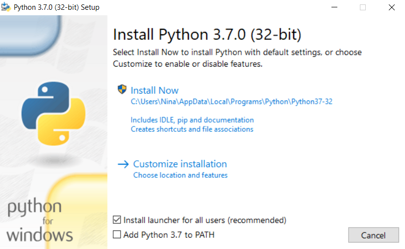
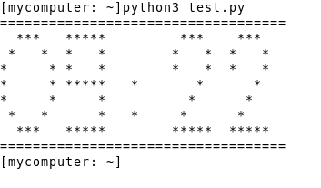

We require you to have a laptop for the practical
exercises. If you do not have one, or want to borrow one from us,
please contact <nina.norgren@scilifelab.se> before the beginning
of the course.

It is important to come prepared _before_ the first lecture, in order
to fully take advantage of the hands-on exercises, coming at a rather high pace.

We have the 3 following requirements:

1. [Install Python](#how-to-install-python) on your machine
2. Make sure you have a [proper text editor](#text-editor)
3. Check that the installation went fine, by [running a given simple script](#test),


----

# How to install Python

Please, choose to install the version `3.6.0` or above. The latest version available is 3.7.0

### On Windows

Here are the [installation steps on Windows](//docs.python.org/3.7/using/windows.html#installation-steps).
The installer should look like:



### On Mac OS X

Since Mac OS X 10.8, Python 2.7 is pre-installed by Apple. This is an incompatible version with this course.
You should instead [download the installer](//www.python.org/ftp/python/3.7.0/python-3.7.0-macosx10.6.pkg) for the version 3.7.0, double-click and follow the instructions.


More information can be found on [docs.python.org/3.7](//docs.python.org/3.7/using/mac.html)

> IMPORTANT NOTE: If you are not interested in a system-wide version
> of Python3, you can use `pyenv` to easily switch between multiple
> versions of Python. You
> can
> [install pyenv from GitHub](//github.com/yyuu/pyenv#installation). After
> installation, you can install version 3.7.0 by issuing the following
> command in your Terminal.
>
> $ pyenv install 3.7.0


### On Linux/Unix
#### Using a package manager
Install Python3 and pip using your package manager. For Ubuntu and Debian, it goes like this:

```
sudo apt-get update
sudo apt-get install python3 python3-pip


Then use pip to install Jupyter (see [below](#jupyter) for more details).

```
sudo python3 -m pip install jupyter
```

You can also use pip to install Biopython:

```
sudo python3 -m pip install biopython
```

#### Installing from source
You can also install [Python from source](https://www.python.org/downloads/).

```

### A note for Linux/Unix and Mac users
The command to run Python is `python3`. If you wish to be able to start Python by typing just `python`,
add the following line to the file `~/.bashrc` (or `~/.bash_profile`):

`alias python=python3`

----

# Using a proper Text Editor {#text-editor}

We are going to type (a lot of) Python code, so you'd better have a
good text editor. This is useful for several reasons: The text editor
can highlight the Python keywords and handles the particulars
regarding tabulations (which we will introduce in the course).

<div id="text-editors">

Emacs and Vim are probably the best text editors, albeit for
tech-savvy people.


If you are not the latter
kind, <a href="//www.sublimetext.com/">Sublime Text</a>
or <a href="//atom.io/">Atom</a> are excellent cross-platform
alternative. You should probably customize it to your taste first.


Another alternative is <a
href="//www.jetbrains.com/pycharm/">PyCharm</a>. It looks promising
but we admit we did not really try it. Go ahead, <a
href="//www.jetbrains.com/help/pycharm/requirements-installation-and-launching.html">install
the free version</a> and give it a try!
<a
href="//www.jetbrains.com/help/pycharm/requirements-installation-and-launching.html"></a>
</div>

----

# Testing your installation {#test}

Start your favorite terminal and check the Python version. Type at the
prompt (ie where the `$` sign is):

```bash
$ python3 --version
```

or start the python interpretor

```bash
$ python3
```

[//]: # (Upon successful installation, you should see something like)

[//]: # ()

## Running a test script

Download
this
[test script](//raw.githubusercontent.com/NBISweden/PythonCourse/ht18/test.py) (from
the NBIS GitHub location for this instance of the course), and in your
terminal, run

```bash
$ python3 test.py
```

...in the folder where the script resides. If this works fine, you
should see the current time printed with "big digits" ;)




----

# Jupyter notebooks {#jupyter}

In the course, we will write Python code as standalone files. However,
during the lecture, we will also use Jupyter
notebooks. [Jupyter](//jupyter.org/) is a web-based tool which
allows us to evaluate our code line by line.  The Jupyter files are
called
[notebooks](//jupyter.readthedocs.io/en/latest/running.html) and
will serve a single purpose in this course: a _quick demonstration_ of
Python code. It is therefore convenient, though optional,
to
[install Jupyter](//jupyter.readthedocs.io/en/latest/install.html) in
advance.


----

# Impatient about the first lecture?

Whet your appetite on
the [Python tutorial](//docs.python.org/3/tutorial/) or
an
[informal introduction to Python](//docs.python.org/3/tutorial/introduction.html).
