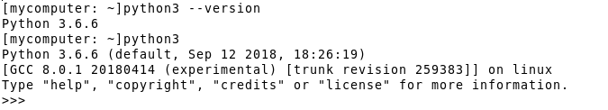

If you want to use your own laptop during this course, we would like you to install Python _before_ the first lecture.

On the [Python website](https://www.python.org/downloads/), the latest
version available is `3.6.0`. Please, choose to install the version
`3.5.0` or above.  You can install the latest Python
on
[Windows](https://www.python.org/downloads/windows/),
[Mac OS X](https://www.python.org/downloads/mac-osx/)
or [Linux/Unix](https://www.python.org/downloads/source/).


# How to install Python 3.5.0

## On Windows

You can borrow a Linux laptop where we have installed Python 3.5+ for you.
If you insist on using your own Windows machine, here are the [installation steps on Windows](https://docs.python.org/3.5/using/windows.html#installation-steps).
The installer should look like:


## On Mac OS X

Since Mac OS X 10.8, Python 2.7 is pre-installed by Apple. This is an incompatible version with this course.
You should instead [download the installer](https://www.python.org/ftp/python/3.5.0/python-3.5.0-macosx10.6.pkg) for the version 3.5.0 (or choose a newer one), double-click and follow the instructions.


                                            
More information can be found on https://docs.python.org/3.5/using/mac.html

> IMPORTANT NOTE: If you are not interested in a system-wide version
> of Python3, you can use `pyenv` to easily switch between multiple
> versions of Python. You
> can
> [install pyenv from GitHub](https://github.com/yyuu/pyenv#installation). After
> installation, you can install version 3.5.0 by issuing the following
> command in your Terminal.
> 
> $ pyenv install 3.5.0

## On Linux/Unix

You probably
know [what to do](https://docs.python.org/3.5/using/unix.html) if we
give you
the
[Python 3.5.0 sources](https://www.python.org/ftp/python/3.5.0/Python-3.5.0.tgz). You
are surely familiar with the classic cycle:
```bash
./configure
make
make test
sudo make install
```

# Testing your installation

Start your favorite terminal and check the Python version
```bash
$ python --version
```
or start the python interpretor
```bash
$ python
```
Upon successful installation, you should see something like



# Optional tools

## Using a proper Text Editor

We are going to type (a lot of) Python code, so you'd better have a
good text editor. This is useful for several reasons: The text editor
can highlight the Python keywords and handles the particulars
regarding tabulations (which we will introduce in the course).

Emacs and Vim are probably the best text editors, albeit for
tech-savvy people. If you are not the latter
kind, [Sublime Text](https://www.sublimetext.com/) is a excellent
cross-platform alternative. You should probably customize it to your
taste first.


## Jupyter: a tool to quickly demonstrate some code

In the course, we will write Python code as standalone files. However,
during the lecture, we will also use Jupyter
notebooks. [Jupyter](http://jupyter.org/) is a web-based tool which
allows us to evaluate our code line by line.  The Jupyter files are
called
[notebooks](http://jupyter.readthedocs.io/en/latest/running.html) and
will serve a single purpose in this course: a _quick demonstration_ of
Python code. It is therefore useful, though optional,
to
[install Jupyter](http://jupyter.readthedocs.io/en/latest/install.html) in
advance.


# Impatient about the first lecture?

Whet your appetite on
the [Python tutorial](https://docs.python.org/3/tutorial/) or
an
[informal introduction to Python](https://docs.python.org/3/tutorial/introduction.html).
